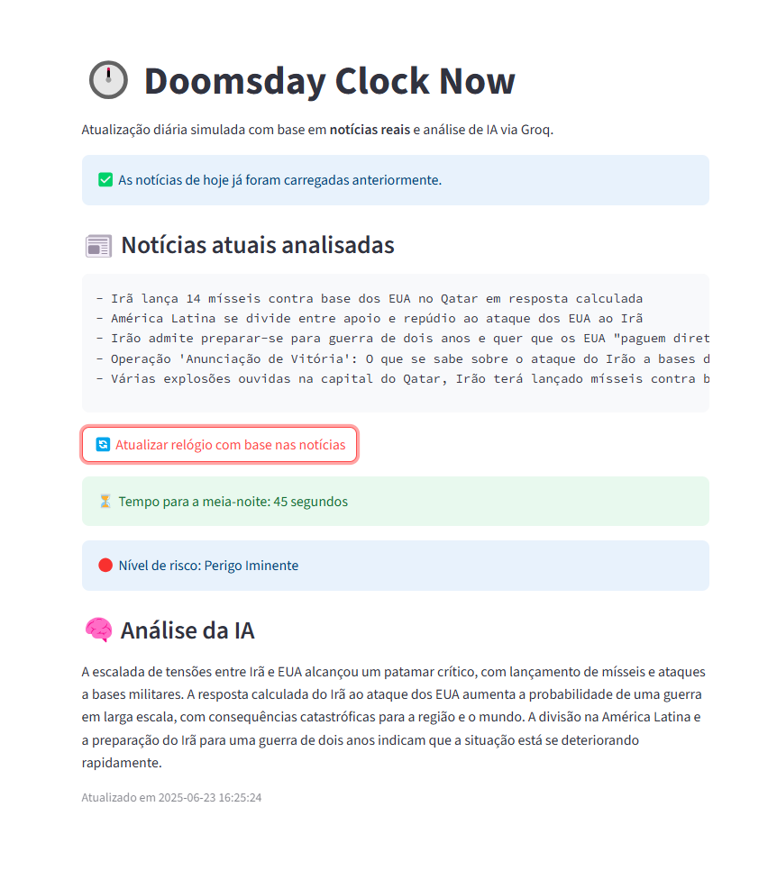

# 🕰️ Doomsday Clock Now

Simulação diária do **Relógio do Juízo Final**, atualizada com base em **notícias reais** e interpretada por **inteligência artificial (IA)** via [Groq API](https://groq.com/).

> 📆 Atualização automática diária. Análise com base em manchetes globais sobre conflitos, clima e geopolítica.

---

## 🔍 Funcionalidades

- 🔄 Busca automática das notícias mais relevantes do dia (via [GNews API](https://gnews.io))
- 🧠 Interpretação das notícias usando IA (modelo `llama3-70b-8192`)
- ⏰ Geração do tempo estimado até a "meia-noite" (fim da humanidade)
- 📈 Classificação do risco: `Estável`, `Aumentando`, `Perigo Iminente`
- 📊 Análise textual explicando o contexto do cenário atual
- 💾 Atualização permitida 1x por dia (economia de requisições)
- 🖥️ Interface leve feita com [Streamlit](https://streamlit.io)

---

## 🚀 Como executar localmente

1. Clone o repositório:
```bash
git clone https://github.com/LukystarWar/doomsday-clock-now.git
cd doomsday-clock-now
```

2. Instale as dependências:
```bash
pip install -r requirements.txt
```

3. Crie um arquivo `.env` com sua chave da Groq API:
```
GROQ_API_KEY=gsk_sua_chave_aqui
GNEWS_API_KEY=sua_chave_gnews_aqui
```

4. Execute o app:
```bash
streamlit run app_streamlit.py
```

---

## 🖼️ Exemplo da Interface



---

## 📌 Observações

- A IA pode gerar interpretações diferentes a cada execução.
- O modelo não prevê o futuro — é apenas uma **simulação reflexiva** com base em dados públicos.

---

## 🧠 Tecnologias usadas

- Python 3.11+
- Streamlit
- Groq (LLama 3 - 70B)
- GNews API
- dotenv
- requests

---

## 📅 Última atualização

23/06/2025

---

Feito com ☕ e ⚠️ por Lucas Castro
